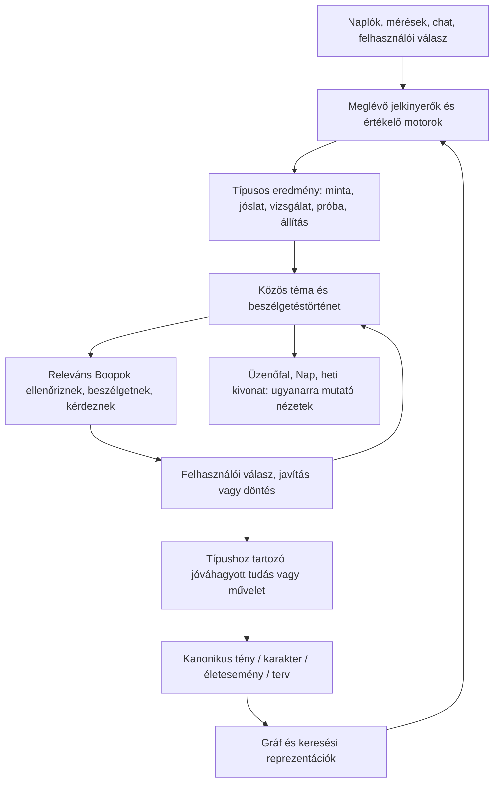

# Boop: közös AI-világ — felületi audit és első tervezési irány

Dátum: 2026-09-21. Driver: **mezo-7fduk**. Kapcsolódó korábbi epic: **mezo-88iwa**.
Állapot: **audit + vizuális döntési alap, még nem jóváhagyott fejlesztési specifikáció**.
A termékkód, az éles adatok és az ütemezések ebben a munkában nem változtak.

## 1. Cél és határ

A Mezo AI-funkciói egy követhető, személyes Boop-világként jelenjenek meg. A kis csapat
valós megfigyelésekről beszélget, alternatív magyarázatokat vizsgál, visszakérdez, majd
ugyanabban a témában mutatja meg az eredményt. A felhasználó hozzászólhat; önálló
feed-poszt létrehozására nincs szükség. Az adatok és a működő képességek megmaradnak.

A jelenlegi agyag/krém/Fraunces/Geist design, az öt saját Boop-figura és a napi
fejlécjelző marad a vizuális alap. Az új irány nem a korábbi Titanium-újratervezés.
A régi epic által hivatkozott `2026-09-15-boop-mezo-coverage.md` a vizsgált checkoutban
nem található; a felhasználó bemásolt leltárát hipotézisként ellenőriztük.

A scope a `/mezo` teljes route-családja, a hozzá kapcsolódó Én/heti nézetek,
Nap-észrevételek és központi személyes beállítások. Más területek összes AI-eszközének
(pl. edzéstervező, receptgenerálás) teljes UX-újratervezése nem része ennek a leltárnak;
az ezekhez vezető jóváhagyott műveletek integrációs pontok.

## 2. Mit ellenőriztünk és hogyan?

Kiindulás: [CODEMAP](../../CODEMAP.md), az [Insights](../../features/insights.md),
[Companion](../../features/companion.md), [Proactive](../../features/proactive.md),
[Character](../../features/character.md) és [Én](../../features/me.md) referencia,
majd a router, oldalak, hookok és az érintett háttérszolgáltatások.
Az éles belépett felület olvasása kiegészítette a kódauditot; nem adtunk le valós
visszajelzést, nem küldtünk chatet és nem indítottunk vizsgálatot.

L = ebben az auditban élesen is megnyitott felület; K = route/kód alapján ellenőrzött;
E = az előző Karakter-fejlesztési kör éles ellenőrzése is rendelkezésre áll.
A részletes történeti oldalak minden rekordját nem olvastuk végig. A napló tartalmát
és személyes egészségadatait nem másoljuk ebbe a tervezési dokumentumba.

| Jelenlegi felület | Ellenőrzés | Saját szerep / forrás | Javasolt hely |
|---|---|---|---|
| `/mezo` belépő + döntéskártya | L/K | Menü + létező minta döntése | Üzenőfal; egy közös döntésobjektum megjelenítése |
| `/mezo/patterns` | L/K | Minták életciklusa, lefedettség | Folyamatban / Minták |
| `/mezo/patterns/:pairKey` | L/K | Bizonyíték, eseménytörténet, tesztterv | A téma részlete; a feed ugyanide nyit |
| `/mezo/predictions` | L/K | Tárolt jóslatok, utólagos értékelés | Folyamatban / Előrejelzések + saját részlet |
| `/mezo/experiments` | L/K | Javasolt, aktív, lezárt egyéni próbák | Folyamatban / Próbák + közös tématörténet |
| `/mezo/diagnozis` | L/K | Felhasználó által indított kérdés | „Járjunk utána” a Folyamatban részen |
| `/mezo/diagnozis/:id` | L/K | Rangolt magyarázatok, bizonyíték, próbaindítás | Vizsgálati téma; eredeti jelentés elérhető marad |
| `/mezo/coaching` | L/K | Napi szabályválasztás magyarázata | Javaslat a feedben; összesített működés a Gépteremben |
| `/mezo/coaching/megfigyelo` | L/K | 16 szabály napi trace-e, sorrend, cooldown | Közös Gépterem / Megfigyelők |
| `/mezo/coaching/kartya` | L/K | Meglévő napi kártya és műveletei | Ugyanaz a kártyaazonosító a Nap és a feed felületén |
| `/mezo/knowledge` postaláda | L/K | Tényjelöltek ÉS életesemény-jelöltek döntése | Egy döntési sor, feedben szűrhető; Rólad ugyanide mutat |
| `knowledge?view=tenyek` | K | Hiteles ténylista, aktív állapot, promptválogatás | Rólad / Tudástár; egyetlen szerkesztési hely |
| `knowledge?view=kategoriak` + node sheet | L/K | Gráf-csomópontok és kapcsolati összefoglalók | Rólad / Kapcsolatok; listás hozzáférés is marad |
| `knowledge?view=hogyan` | K | Működési magyarázat | Gépterem + helyi „Miből látszik?” |
| `knowledge?view=profil` | K | Már átirányít a központi beállításra | Meglévő `/settings/mezo/communication` |
| `/mezo/memoir` | L/K | Legutóbbi heti történet, források, visszajelzés | Emlékek / Hetek; feedben rövid hivatkozás |
| `/mezo/memoir/archivum` | L/K | Korábbi fejezetek | Emlékek idővonala |
| `/mezo/memoir/:weekStart` | K | Egy tárolt fejezet | Emlékek heti részlet, régi mélylink megőrzése |
| `/mezo/memoria` Rétegek | L/K | Memóriacsővezeték és mennyiségek | Közös Gépterem / Memória |
| Memória / Napló | L/K | Napi AI-összegzések | Emlékek / Napok + új napi mélylink |
| Memória / Kereső | L/K | Hasonló emlékek visszakeresése | Emlékek keresője |
| Memória / Audit | L/K | Költségek és a tudástár ténylistájának másolata | Költség → Gépterem; eredet → a kanonikus tény részlete |
| `/mezo/karakter`, `/feed` | E/K | Napi csapatbeszélgetések, hozzászólások, kimenetek | Üzenőfal alapja; a régi napló archivált szűrő |
| `/karakter/dimenziok`, `/dimenzio/:key` | E/K | 7 dimenzió, javítható karakterállítások | Rólad / Karakter; nem azonos a ténylistával |
| `/karakter/csapat` | E/K | 9 szakértő-szerep | Avatarból nyíló profil + közös csapatnézet |
| `/karakter/konzilium` + kiválasztott archív ülés | E/K | Valós tanácskozási fordulók, kimenetek | Témabeszélgetések; ülés mint forrás/archív szűrő |
| `/karakter/gepterem` | E/K | Karakter-futások belépője | Egy közös Gépterem |
| `/gepterem/futasok`, `/futas/:id` | E/K | Futáslista, szakértők, konferencia-link | Gépterem / Futások + futásrészlet |
| `/gepterem/adatforrasok`, `/adatforrasok/kor/:n` | E/K | Bekötött/tervezett forráskörök | Gépterem / Adatforrások; a terv nem aktív képesség |
| `/gepterem/detektorok` | E/K | Aktív detektorkatalógus | Gépterem / Megfigyelők |
| `/mezo/chat` | L/K | Gazdag önálló chat, hang, eszköz- és emlékeredet | Közvetlen fejlécajtó; beszélgetéshez csatolható téma |
| `/mezo/weekly`, `/mezo/motor` | K | Már redirect: Én/heti, illetve Minták | Újabb tartalom nem épül ezekre |
| `/me/week`, `/elemzes`, `/napok`, `/napok/:date` | L/K | Heti/napi értékelés és tényleges napadatok | Én területen maradnak; kölcsönös mélylinkek |
| `/me/week/tanulsagok` | L/K | Ugyanazon tényjelöltek heti szűrt döntési nézete | Link a közös döntési sorra, heti szűréssel |
| `/me/week/felfedezesek` | L/K | Nyers heti digest, meglévő objektumok kivonata | Rövid összegzés és eredeti témákra mutató linkek |
| Nap / észrevételek, napi javaslat | K | Napi kontextusban fontos jel, meglévő reply/action | Rövid helyi megjelenés, ugyanaz a téma és döntés |
| Személyes bemutatkozás / kommunikáció / kontextuselőnézet | K | Már szerkeszthető explicit instrukció és tanult profil | Központi Beállítások; Rólad ide is vezet |
| Napi fejléc-ikon | L/K | Kedvelt napi egység- és pontszámfelület | Változatlan képesség és meglévő komponens |

## 3. Az eredeti leltár helyesbítése

**Valós felületi duplikáció:** `MemoryAuditPanel` ugyanazt a `useKnowledge()` ténylistát
olvassa, mint a Tudástár. A `WeekLessonsPage` ugyanazt a jelölt-döntési folyamatot teszi
ki másodszor, heti szűréssel. A Gépterem funkciói több menüben élnek. A jelenlegi
belépő sok ajtót mutat, de a következő teendőt és a témák folytonosságát nem rendezi.

**Nem bizonyított három külön ténytár:** a gráf FACT csomópontjai tükrözések/kapcsolati
reprezentációk is lehetnek. A tárolók és felületek száma nem azonos. Az összevonás
nem jelent automatikus táblatörlést. A tény, a karakterállítás és az életesemény
eltérő típus és eltérő döntés marad.

**Nem négy fölösleges emlék:**

| Objektum / folyamat | Mire kell? | Döntésjavaslat |
|---|---|---|
| `daily_summary` | Naplózott nap narratív emléke, visszakeresés alapja | Emlékek napi olvasónézet + források |
| `period_summary` | Heti/havi tömörítés a hosszú távú visszakereséshez | Háttérben marad; nem külön olvasnivaló |
| Memoár | Felhasználónak szánt heti történet | Heti fejezet az Emlékekben |
| `weekly_review` / napi értékelés | Elemzés, értékelés, tanulságjelöltek | Én területe + ugyanazon jelöltek hivatkozása |
| `ReflectionJob` | Jelkinyerés, hipotézisértékelés és új feltevések | Motorfolyamat; a kimenete lép be a közös témákba |
| Heti felfedezés-digest | Meglévő eredmények heti kivonata | Nem új AI-generálás; csak egyszerűbb megjelenítés |

Az előrejelzési találati mutató **már létezik**. A hiány a saját részletes oldal,
a világos nevező és a mérhetetlen/le nem zárható esetek külön kezelése.
A napi emlékek **elérhetők** a Memória/Napló fülön; külön nap-részlet és mélylink hiányzik.
Az „Így beszélj velem” **már szerkeszthető** a központi beállításokban. A saját kérés
és az automatikusan tanult profil helyesen különálló; ezt meg kell őrizni.
A diagnózis **már képes próbát indítani**. Ezt a kapcsolatot kell olvashatóvá tenni.
A gráf tárolása létezik, de a jelenlegi frontend API `topEdges` szövegeket és élszámot
ad, nem teljes rajzolható topológiát. Valódi csillagképhez szerződésbővítés kell.

Források: `frontend/src/features/insights/components/MemoryAuditPanel.tsx:41`,
`frontend/src/features/me/pages/WeekLessonsPage.tsx`, `WeekDiscoveriesPage.tsx`,
`frontend/src/features/settings/pages/MezoPersonalPage.tsx:20`,
`frontend/src/features/insights/pages/KnowledgeListPage.tsx:172`,
`frontend/src/data/insights/graphApi.ts`, valamint a CODEMAP-ban felsorolt
`WeeklyLessonService`, `PeriodSummaryService`, `MemoirGenerator`, `ReflectionJob`.

## 4. Megfigyelt állapotellentmondások

- **mezo-537kp:** sikertelen előrejelzés alatt is „✓ Bejött:” jelenik meg.
  `PredictionsPage.tsx:121` feltétel nélkül ezt a prefixet használja az `actual` sorhoz.
- **mezo-xasp9:** ugyanazon minta listája „megbízható jel”, részlete „GYŰLIK” állapotot
  mutat. Az összes nap és a csoportonkénti napok más nevezője indokolt lehet, de a
  két státusz és a döntési jogosultság együtt nem érthető. Gyökérok még vizsgálandó.
- A Memória aktív tényekre vonatkozó „promptban” száma és a Tudástár promptválogatási
  száma eltérő fogalmat sugall. Egységesen: tárolt / aktív / ebben a kontextusban bevont.
- Az Audit forráscsoportjai chat/pattern/manual értékeket sorolnak; a heti forrású
  tények így kimaradhatnak a részlistából. A kanonikus tény eredetnézete oldja ezt fel.

Ezek nem pusztán stílusproblémák. Az új felülethez közös állapot- és eredetértelmezés kell.

## 5. Három lehetséges felosztás

1. **Csak közös feed a régi menük fölött.** Kisebb átállás, de a sok világ és a
   duplikált döntési helyek megmaradnak. Átmeneti migrációs lépésnek jó.
2. **Üzenőfal + Folyamatban + Rólad + Emlékek — javasolt, ezt mutatja a prototípus.**
   A napi olvasást elválasztja a tartós visszakereséstől. A funkciók típusa szűrő és
   részlet lesz, nem tíz külön világ. Hátrány: mélylink-migráció és közös olvasási modell kell.
3. **Minden kizárólag a feedben.** Erős social élmény, de egy hónapos mintát vagy
   tényt nehéz megtalálni. A tartós nyilvántartás miatt ezt nem javasoljuk.

A kezdő feed szerkesztett napi kiadás: fontos újdonságok, válaszra váró témák,
követett ügyek. A teljes időrendi archívum elérhető marad. Nem cél a végtelen görgetés.
Ez egy prototípushoz választott alapfeltevés, nem a felhasználó már jóváhagyott döntése.

## 6. Egy közös téma, többféle eredmény

A „téma” közös olvasási és beszélgetési keret, nem egyetlen új mindent-tároló tábla.
Minta, próba, jóslat önállóan is indulhat; nem erőltetjük mindet egy minta alá.
A téma összeköti a kapcsolódó objektumokat. A részlet mindig megmutatja a típust,
a forrást, az állapotot, a nyitott kérdést és a következő lépést.

**Szerző és igazság:** a megszólaló Boop a szakértői szerep. A statisztikát a mérőmotor
értékeli, az AI a magyarázatokat vizsgálja és érthetően közvetíti. Reakció nem növeli
statisztikai bizonyosságot. Az AI-k egyetértése sem független bizonyíték.

**Felhasználói válasz:** a pontos szöveg forrásként, szerzővel és témakapcsolattal
megmarad; újraértékelési kérést indíthat. Mentett tényhez a saját típusa szerinti
jóváhagyás kell. Korrekció érvénytelenítheti a korábbi következtetést, de nem írhatja
át visszamenőleg a nyers méréseket. Műveleti terv/étrend/edzés külön előnézet és
jóváhagyás nélkül nem változik.

**Egy döntési postaláda:** az összes döntési tárgy egy közös sorban elérhető, de a
tényjelölt és az életesemény backend-döntése külön marad. A feed és a Rólad csak
ugyanarra a döntésre vezető bejárat. Idempotens jóváhagyás, elavult verzió ellenőrzése,
valamennyi nézet frissítése és világos visszavonási határ szükséges.

## 7. Mikor legyen új élet a feedben?

A kód jelenlegi alapbeállításai: napi összegzés 02:20; minták 02:40;
karakter-megfigyelés 02:50; reflexió 03:40; napi konzílium 05:15-től
Europe/Budapest szerint, 15 perces ellenőrzéssel; napi companion feed 05:45,
12:30, 20:30; jóslatvalidálás 06:15; próbaeredmény 06:20; heti jóslat hétfő 06:30,
próbajavaslat hétfő 06:45, heti review hétfő 06:50; memoár vasárnap 19:00.
Ezek **konfigurációs alapértékek, nem igazolt éles futási időpontok**; ahol a job nem
ad meg zónát, a szerver ütemezési zónája érvényes. Feature flag, adat és aktivitási
feltétel megakadályozhat egy futást.

A napi tanácskozás tehát már elkészült; nem újabb párhuzamos napi generátort kérünk.
A mostani `CharacterCouncilJob`/budget/reply-recovery alapot kell továbbvizsgálni és
kiterjeszteni. A jelenlegi tanácskozás témákat, hívásokat, okos hívásokat, fordulókat,
résztvevőket és tool-hívásokat már korlátoz.

Javaslat: reggel egy kiadás a kész forrásokból; napközben csak érdemi eseményre
új hozzászólás (válasz, lezárt próba, új bizonyíték, lejárt jóslat). Ha a forrás később
készül el, ugyanazt a témát frissítsük. A heti/havi motorok hosszabb távú munkát végeznek,
nem ugyanazt a napi történetet írják át. A csendes nap is őszinte állapot.

A résztvevők témaszerinti routingot kapjanak, ne minden eredményhez mind a kilenc
szerep beszéljen. Olvasóeszközök: meglévő források, időablakok, ellenpéldák,
összehasonlítások. Okosabb modell költségkereten belül, összetett ellentmondásra;
a modellkonfiguráció külön döntés, nem automatikus költségemelés.

## 8. Megvalósítási következmények — jóváhagyás után részletezendő

- Közös témakapcsolat + típusos forráshivatkozás + közös feed-olvasási modell.
  Kezdetben a meglévő tárolók fölött; sem adatvesztés, sem párhuzamos ténytár.
- Eseményenkénti idempotencia: forrásazonosító + verzió + eseménytípus. Új hozzászólás
  és frissített régi eredmény ne jelentsen új, duplikált kezdőposztot.
- Stabil rendezés, olvasottság, követés és döntési állapot; pagination az archívumhoz.
- Valódi várakozó/feldolgozás alatt/kész/hiba állapot, újrapróbálás és megőrzött válasz.
  „Ír…” jelzés csak ténylegesen futó generálás alatt.
- Kanonikus megállapításverzió; javításkor a függő összefoglalók, gráf és retrieval
  reprezentációk frissítése, visszavonás hatásának követése.
- Valamennyi forrás és téma tulajdonoshoz kötött; B-user/404 tesztek, jogosultsági szűrés
  a visszakeresésben és a cron fan-outban is. Kommentben érkező szöveg adat, nem toolutasítás.
- Régi mélylinkek átirányítása tartalomazonosítóval, heti/dátumszűrés és visszanavigálás
  megőrzésével. Feature flag mellett fokozatos átállás, meglévő rekordok visszakötése.
- Szerződésbővítés: tématörténet, napi kiadás, jóslat-részlet, napi emlék-részlet,
  teljes gráf-topológia csak akkor, ha a csillagkép mellett döntünk.

A gates a későbbi megvalósításhoz: egyetlen döntés minden nézetben, nincs duplikált
poszt/mentés retry után, mérhetetlen jóslat nem hit/miss, korrekt adatjavítás utáni
újraértékelés, tulajdonos-szigetelés, két frontend adatmód, mobil és reduced-motion.

## 9. Vizuális terv és iteráció

[Interaktív fragment](assets/boop-social-world-v1.html). A beszélgetésben inline, helyi
előnézetben sandbox-keretben jelenik meg. Szintetikus adatok, nincs hálózati írás vagy AI-futás.

A négy főnézet, a közös témarészlet, a glass bizonyítékpanel, a szakértőprofilok,
a feedreakciók, a hozzászólás útja és a tudás jóváhagyás/visszavonás kipróbálható.
A chat, a részletes gépterem és az Én heti nézete kapcsolódási előnézet, nem teljes
újratervezett oldal. A teljes gráfra a terv listás alternatívát mutat; a csillagkép
külön vizuális iteráció lehet. Az első kör a navigáció és a közös témák érthetőségéről dönt.

Mozgás: a saját Boopok lélegeznek/pislognak, eltolt ritmussal; reduced-motion mellett
statikusak. Jutalom: apró „pontosabb lett a közös kép” visszajelzés. Nincs egyetértési
pontszám, kényszerített streak vagy jutalom bizonytalan egészségkövetkeztetésért.

A következő döntés: működik-e az Üzenőfal/Folyamatban/Rólad/Emlékek felosztás és
elég social-e a bejegyzés–hozzászólás ritmus? Jóváhagyás után készülhet végleges
specifikáció, részletes backend-szerződés és Beads megvalósítási bontás.

### Első prototípuskör ellenőrzése

Böngészőben ellenőrizve: négy főnézet, típusszűrés, emlékkeresés, szakértőlista,
glass bizonyíték, válaszbeírás és folyamatelőnézet, jóváhagyott tény megjelenése a
Rólad nézetben. A 320 px-es iframe-ben a gyökér és a scroll-szélesség egyaránt 320 px;
a keskeny nézet és a glass panel vizuálisan is ellenőrizve.
A sandbox nem enged natív form-submitot; a lokális demó gombjai explicit eseménykezelést
kaptak. Nem használnak hálózati kérést. Az animáció CSS reduced-motion szabállyal védett.

`node scripts/lint-docs.mjs`: 0 sémahiba, 2 figyelmeztetés, 9 stale dokumentum miatt
nem zöld. A hozzáadott tervezési fájlok ideiglenes eltávolításával ugyanazt a lintet
újrafuttatva a teljes kimenet byte-azonos (`cmp`): a jelzések a kiinduló állapotban is
jelen vannak. Termékkód nem változott, alkalmazástesztet emiatt nem futtattunk.
